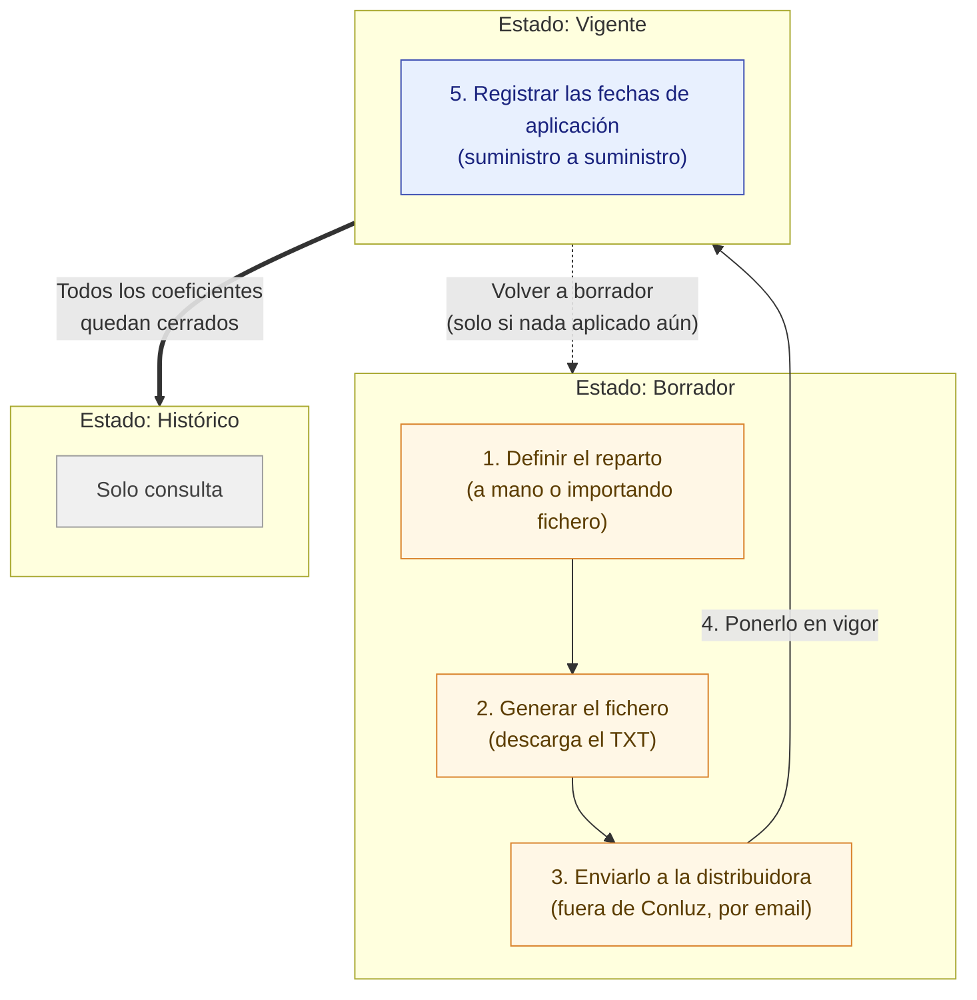

# Manual de uso: Acuerdos de reparto

Este manual explica, paso a paso, cómo usar la sección **Acuerdos de reparto** de Conluz. Está pensado para personas que la usan por primera vez.

## ¿A quién va dirigido este manual?

A **administradores de comunidad**. Esta sección solo es accesible para quien tiene el rol de administrador en la comunidad activa; los miembros de la comunidad que no tengan rol de administrador no ven esta pantalla.

## ¿Qué es un acuerdo de reparto?

Un acuerdo de reparto define **qué porcentaje de la energía producida por una planta corresponde a cada punto de suministro** (vivienda, local, etc.) de la comunidad energética. Ese porcentaje se llama **coeficiente de reparto**, y la suma de todos los coeficientes de un acuerdo debe ser siempre **100,0000 %**.

Cada acuerdo pasa por tres estados a lo largo de su vida:

| Estado | Significado |
|---|---|
| **Borrador** | Se está preparando. Los coeficientes se pueden editar libremente. |
| **Vigente** | Ya se ha puesto en marcha. Los coeficientes quedan fijados y no se pueden editar; solo se puede registrar cuándo la distribuidora aplica cada uno. |
| **Histórico** | Ha sido sustituido por un acuerdo posterior. Es de solo consulta. |

Dentro de un acuerdo, preparar y desplegar el reparto sigue conceptualmente **cinco pasos**:

1. **Definir el reparto** — introducir los coeficientes, a mano o importando un fichero.
2. **Generar el fichero** — Conluz construye el fichero TXT que hay que enviar a la distribuidora.
3. **Enviarlo a la distribuidora** — fuera de Conluz, normalmente por email. La aplicación no puede comprobar este paso.
4. **Ponerlo en vigor** — sellar el reparto una vez que la distribuidora lo ha aceptado.
5. **Registrar las fechas de aplicación** — anotar, suministro a suministro, cuándo la distribuidora ha empezado a aplicar cada coeficiente. Hasta que un punto no tiene fecha, no recibe producción.

*Los pasos 1 a 3 ocurren mientras el acuerdo está en **Borrador**; el paso 4 (Poner en vigor) es la transición a **Vigente**; el paso 5 ocurre ya en estado **Vigente**. Un acuerdo pasa a **Histórico** cuando **todos sus coeficientes tienen fecha de fin** — normalmente porque un acuerdo posterior los ha ido cerrando.*

---

### Cómo se organiza la pantalla de un acuerdo

La pantalla de detalle está ordenada según ese ciclo, de arriba abajo:

1. **Nombre y estado**, con el menú **⋮** de opciones del acuerdo, y tres datos identificativos con su
   etiqueta: **CAU de la planta**, **Potencia instalada** y **Puntos de suministro**. Bajo ellos,
   **Ver más datos del acuerdo** despliega la fecha de creación y las notas internas.
2. **Siguiente paso** — una banda azul con una frase que dice qué toca hacer ahora, el botón que lo hace y,
   si algo lo impide, el motivo escrito a la vista. Debajo, los cinco pasos en pequeño, con **Ver todos los
   pasos** para desplegar su descripción. El paso 3 aparece siempre marcado como *fuera de Conluz*: la
   aplicación no puede comprobar que hayas enviado el fichero.
3. **Aplicación del reparto** — solo en acuerdos **Vigente** e **Histórico**, y en Vigente es la primera
   sección de todas.
4. **Reparto** — los coeficientes, su suma y las dos formas de definirlos.
5. **Fichero para la distribuidora** — generar y descargar, y el fichero importado.

Si no sabes por dónde seguir, lee el bloque **Siguiente paso**: dice siempre una sola cosa.

---

## Índice

Antes de empezar: [cómo se organiza la pantalla de un acuerdo](#cómo-se-organiza-la-pantalla-de-un-acuerdo).

1. [Acceder a la sección](#1-acceder-a-la-sección)
2. [Crear un nuevo acuerdo de reparto](#2-crear-un-nuevo-acuerdo-de-reparto)
3. [Definir el reparto (coeficientes)](#3-definir-el-reparto-coeficientes)
4. [Generar el fichero para la distribuidora](#4-generar-el-fichero-para-la-distribuidora)
5. [Enviar el fichero a la distribuidora](#5-enviar-el-fichero-a-la-distribuidora)
6. [Poner el acuerdo en vigor](#6-poner-el-acuerdo-en-vigor)
7. [Registrar la fecha de aplicación de cada suministro](#7-registrar-la-fecha-de-aplicación-de-cada-suministro)
8. [Volver a borrador](#8-volver-a-borrador)
9. [Gestionar coeficientes ya aplicados](#9-gestionar-coeficientes-ya-aplicados)
10. [Eliminar un acuerdo](#10-eliminar-un-acuerdo)
11. [Consultar un acuerdo histórico](#11-consultar-un-acuerdo-histórico)
12. [Buscar y filtrar](#12-buscar-y-filtrar)
13. [Qué puedo hacer en cada estado (resumen)](#13-qué-puedo-hacer-en-cada-estado-resumen)
14. [Solución de problemas y preguntas frecuentes](#14-solución-de-problemas-y-preguntas-frecuentes)

---

## 1. Acceder a la sección

1. Entra en la ficha de la planta desde **Producción**.
2. Accede a **Acuerdos de Reparto**. La ruta de navegación (breadcrumb) muestra: `Inicio → Producción → [Planta] → Acuerdos de Reparto`.

Si tu rol en la comunidad activa no es de administrador, no podrás acceder a esta pantalla.

<!-- SCREENSHOT: breadcrumb de navegación hasta "Acuerdos de Reparto" -->

Al entrar verás:

- Un encabezado con el nombre de la planta y su **CAU** (código regulatorio).
- Tres indicadores con el número de acuerdos en cada estado: **Vigente**, **Borradores** e **Históricos**.
- La lista de acuerdos existentes, ordenados en una línea de tiempo.

<!-- SCREENSHOT: vista completa de la lista de acuerdos de reparto de una planta, con los indicadores de estado y la línea de tiempo -->

---

## 2. Crear un nuevo acuerdo de reparto

1. En la lista de acuerdos, pulsa **Nuevo acuerdo de reparto**.
2. Rellena el formulario:
   - **Capacidad de generación de la planta** (en kW): la potencia pico instalada en el momento de este acuerdo. Debe ser un número mayor que 0. Se rellena automáticamente con la potencia registrada de la planta, aunque puedes ajustarla.
   - **Nombre del acuerdo**: un nombre identificativo, por ejemplo *"Recálculo julio 2026"*. Es obligatorio.
   - **Notas internas** (opcional): motivo del nuevo reparto, cambios respecto al anterior, etc.
3. Pulsa **Crear borrador**.

El acuerdo se crea en estado **Borrador** y la aplicación te lleva directamente a su pantalla de detalle.

Para corregir después cualquiera de estos tres datos —nombre, notas o capacidad— abre el menú **⋮** de la
pantalla de detalle y elige **Editar datos del acuerdo**. Está disponible en **todos los estados**, también en
Vigente e Histórico: cambiarlos no toca los coeficientes. Si el acuerdo ya tiene coeficientes y modificas la
capacidad, el formulario te avisa de que eso no cambia los coeficientes guardados, pero sí cambia la potencia
en kW que corresponde a cada suministro según ellos.

> **Aviso que verás en el formulario:** al poner en vigor un acuerdo, el conjunto de coeficientes queda fijo para siempre; cualquier cambio futuro requerirá un nuevo acuerdo. Tenlo en cuenta antes de avanzar en el ciclo de vida.

<!-- SCREENSHOT: diálogo "Nuevo acuerdo de reparto" con los campos Capacidad, Nombre y Notas rellenados -->

---

## 3. Definir el reparto (coeficientes)

Desde la pantalla de detalle de un acuerdo en **Borrador**, la sección **Reparto** reúne las dos formas de
definir los coeficientes, una al lado de la otra: **Editar a mano** e **Importar TXT**. Elige la que mejor se
adapte a tu caso. (Mientras el reparto esté incompleto, esos mismos dos botones aparecen arriba, en el bloque
**Siguiente paso**.)

La sección **Reparto** muestra además:

- La **suma de los coeficientes**, que debe llegar exactamente a 100,0000 %, y cuánto falta o sobra.
- Una columna **Potencia asignada** por punto: *la parte de la potencia instalada que corresponde a cada punto
  según su coeficiente. No es potencia garantizada: la energía que recibe depende de lo que produzca la planta
  en cada momento.*

Los coeficientes reparten la producción de la planta y son la base del cálculo de autoconsumo y excedentes en
tiempo real.

### 3a. Introducir los coeficientes a mano

1. Pulsa **Editar a mano**.
2. Si necesitas añadir suministros al reparto, pulsa **Añadir suministro**, marca los suministros deseados en el buscador (por nombre o CUPS) y confirma con **Añadir (N)**.
3. Para cada suministro de la tabla, escribe su coeficiente. El interruptor **Editar coeficientes en: % | kW**
   te deja trabajar en porcentaje o en kW; se guarda lo mismo en ambos casos, y cambiar de unidad no pierde
   ningún valor.
4. En porcentaje se admiten **cuatro decimales** (`30,0000`), que son los que caben en el fichero de la
   distribuidora. Si escribes más, la fila te avisa con *"Como máximo 4 decimales"* y **Guardar** queda
   bloqueado: Conluz no redondea por su cuenta una cifra que va a la distribuidora.
5. Revisa la **suma del fichero**: debe llegar exactamente a 100,0000 %. La pantalla te indica cuánto falta o sobra mientras editas.
6. Pulsa **Guardar** para confirmar los coeficientes, o **Cancelar** para descartar los cambios.

Puedes quitar un suministro de la edición con el icono de eliminar de su fila.

<!-- SCREENSHOT: tabla en modo edición con el interruptor "% | kW", varios coeficientes en porcentaje y el resumen de suma -->

### 3b. Importar un fichero ya elaborado

Si ya tienes preparado el fichero TXT del reparto (por ejemplo, generado por otro medio), puedes importarlo directamente:

1. En la sección **Reparto**, pulsa **Importar TXT**.
2. Selecciona el fichero con **Seleccionar fichero** (debe tener extensión `.txt` y seguir el formato de nombre `<CAU>_AAAA.txt`).
3. Pulsa **Subir fichero**.

> **Importante:** subir un fichero nuevo **sustituye por completo** el conjunto de coeficientes actual del acuerdo.

Si el fichero no es válido, la aplicación no modifica ningún coeficiente y te muestra el detalle de los errores (por fichero o por línea, por ejemplo *"el CUPS … no pertenece a ningún suministro"*) para que los corrijas en origen y vuelvas a intentarlo con **Elegir otro fichero**.

Si la planta no tiene CAU asignado, no podrás importar un fichero hasta añadirlo desde a la planta.

<!-- SCREENSHOT: sección "Reparto" con los botones "Editar a mano" e "Importar TXT", el diálogo de importación, y la pantalla de errores de un fichero rechazado -->

---

## 4. Generar el fichero para la distribuidora

Una vez que la suma de los coeficientes es exactamente 100,0000 %, puedes generar el fichero que enviarás a la
distribuidora. La sección **Fichero para la distribuidora** tiene dos bloques:

- **Generar y descargar** — el fichero se construye en ese momento con los coeficientes actuales. **Conluz no lo
  guarda**: se descarga en tu dispositivo y lo envías tú.
- **Fichero importado** — el TXT que subiste, si subiste alguno, con su nombre y su fecha. Son cosas distintas:
  generar no rellena este bloque.

Para generarlo:

1. En **Generar y descargar**, pulsa **Generar y descargar TXT**.
2. Indica el **Año** correspondiente al reparto.
3. Pulsa **Generar**.

El fichero se descarga automáticamente con el nombre `<CAU>_<año>.txt`. Si vuelves a cambiar los coeficientes,
tendrás que generarlo de nuevo.

El botón indica su motivo, con texto a la vista, cuando no puede usarse:
- la planta no tiene CAU asignado, o
- la suma de los coeficientes todavía no llega a 100,0000 % (*"Faltan X para llegar al 100,0000 %"*).

> Si el acuerdo tiene un **fichero importado** y estás en Borrador, verás una nota permanente bajo él: *"Si
> editas los coeficientes, este fichero deja de coincidir con el reparto."* Conluz no compara ambos por ti.

<!-- SCREENSHOT: sección "Fichero para la distribuidora" con los bloques "Generar y descargar" y "Fichero importado", el diálogo del año, y el aviso posterior a la descarga -->

---

## 5. Enviar el fichero a la distribuidora

Este paso ocurre **fuera de Conluz**: envía el fichero generado a la distribuidora eléctrica por tu canal habitual (normalmente email). La aplicación no realiza ni verifica este envío, así que asegúrate de conservar constancia por tu cuenta.

---

## 6. Poner el acuerdo en vigor

Cuando la distribuidora haya aceptado el reparto, sella el acuerdo:

1. En la pantalla de detalle, busca el bloque **Siguiente paso**, en la banda azul bajo el nombre del acuerdo.
2. Pulsa **Poner en vigor**.
3. Confirma en el diálogo.

El acuerdo pasa a estado **Vigente** y sus coeficientes dejan de poder editarse.

**El botón solo aparece cuando la acción puede completarse.** Mientras el reparto no sume exactamente
100,0000 %, Conluz no muestra **Poner en vigor** en absoluto: en su lugar el bloque **Siguiente paso** te dice
qué falta —«Este acuerdo todavía no tiene coeficientes» o «Faltan X para llegar al 100,0000 %»— y te ofrece
**Editar a mano** e **Importar TXT**, que es lo que toca hacer en ese momento.

> **Aviso que verás en el diálogo de confirmación:** hazlo cuando la distribuidora haya aceptado el reparto.
> Poner en vigor no aplica nada por sí mismo: después tendrás que registrar la fecha de aplicación de cada
> punto. Hasta entonces el acuerdo **no reparte producción**, y el autoconsumo y los excedentes solo se
> muestran con los datos de la distribuidora, que llegan con varios días de retraso.
> Podrás volver a borrador mientras no se haya aplicado ningún coeficiente; en cuanto se aplique el primero,
> dejará de ser posible.

<!-- SCREENSHOT: bloque "Siguiente paso" con el botón "Poner en vigor", y el diálogo de confirmación -->

---

## 7. Registrar la fecha de aplicación de cada suministro

**Este paso no es opcional.** Un acuerdo Vigente no reparte nada por el hecho de estar vigente: cada punto de
suministro empieza a recibir producción **desde su fecha de aplicación**, y un punto sin fecha no recibe nada.
Mientras no registres ninguna, verás un aviso en la cabecera: *«Vigente, pero todavía no reparte producción:
registra las fechas de aplicación.»*

En un acuerdo Vigente, la primera sección de la pantalla es **Aplicación del reparto**. Te dice cuántos puntos
tienen ya fecha («3 de 12 puntos con fecha de aplicación»), recuerda la consecuencia de no tenerla, y ofrece el
botón **Registrar fechas (N pendientes)**.

Al pulsar **Registrar fechas** —en la sección **Aplicación del reparto** o en el bloque **Siguiente paso**—
Conluz te lleva a la tabla de coeficientes y la filtra por **Sin aplicar**, para que veas solo los puntos que
te faltan. **No marca ninguno**: normalmente la distribuidora no aplica todos el mismo día, así que eres tú
quien decide qué puntos comparten fecha.

Para registrar varias fechas a la vez:

1. Pulsa **Registrar fechas**.
2. Marca con la casilla de su fila los puntos que comparten la misma fecha de aplicación (en móvil tienes
   **Seleccionar todas** para marcar de golpe los que estés viendo).
3. En la barra que aparece al pie, pulsa **Acciones → Registrar fecha**.
4. Indica la **Fecha de aplicación** (no puede ser una fecha futura) y confirma.

Para un solo suministro, abre el menú de acciones (**⋯**) de su fila y selecciona **Registrar fecha**.

<!-- SCREENSHOT: sección "Aplicación del reparto" con el progreso y el botón "Registrar fechas", y la barra de selección múltiple al pie -->

---

## 8. Volver a borrador

Si necesitas corregir algo antes de que la distribuidora haya aplicado ningún coeficiente, puedes deshacer el paso a vigor:

1. En el bloque **Siguiente paso**, pulsa **Volver a borrador**.
2. Confirma en el diálogo.

El acuerdo vuelve a estado **Borrador** y sus coeficientes vuelven a ser editables.

> Esta opción solo está disponible mientras **ningún** coeficiente del acuerdo se haya marcado todavía como aplicado. En cuanto se registre la primera fecha de aplicación, esta opción desaparece y cualquier corrección posterior requerirá un acuerdo nuevo.

---

## 9. Gestionar coeficientes ya aplicados

Una vez que un coeficiente está aplicado, sigue teniendo acciones disponibles en su menú de fila (**⋯**), todas ellas con efecto retroactivo sobre el histórico de producción de ese suministro:

| Acción | Cuándo está disponible | Qué hace |
|---|---|---|
| **Corregir fecha** | Coeficiente aplicado | Cambia la fecha de aplicación y recalcula la producción atribuida desde entonces. |
| **Desactivar** | Coeficiente aplicado | Revierte la activación; el coeficiente vuelve a quedar pendiente de aplicación. |
| **Cerrar (baja)** | Coeficiente aplicado y sin fecha de fin | Indica la fecha en la que el suministro deja de recibir producción de este reparto. |
| **Reabrir** | Coeficiente cerrado | Elimina la fecha de fin y reabre el coeficiente. |

Todas estas acciones también admiten selección múltiple desde la barra de acciones al pie de la tabla, y muestran una advertencia explícita sobre el efecto retroactivo antes de confirmarse.

<!-- SCREENSHOT: menú de fila de un coeficiente aplicado mostrando las opciones Corregir fecha / Desactivar / Cerrar (baja), y un diálogo de confirmación con el aviso de efecto retroactivo -->

---

## 10. Eliminar un acuerdo

Solo puedes eliminar un acuerdo mientras está en **Borrador**:

1. Desde la lista de acuerdos, abre el menú (**⋮**) de la tarjeta del acuerdo, o desde su pantalla de detalle, el menú de tres puntos.
2. Selecciona **Eliminar**.
3. Confirma en el diálogo, que te recuerda que se eliminarán permanentemente el borrador y sus coeficientes.

Eliminar un borrador **no afecta** al historial de reparto de los miembros, ya que ningún cálculo depende de un borrador.

<!-- SCREENSHOT: diálogo de confirmación "Eliminar acuerdo de reparto" -->

---

## 11. Consultar un acuerdo histórico

Un acuerdo pasa a **Histórico** cuando **todos sus coeficientes tienen fecha de fin**, es decir, cuando ninguno
sigue cubriendo el reparto. En la práctica eso ocurre al desplegar un acuerdo posterior, porque cada coeficiente
nuevo cierra al anterior — pero lo que marca el cambio de estado es el cierre de los coeficientes, no la
publicación del acuerdo siguiente.

Un acuerdo histórico es, en lo esencial, un registro de consulta:

- Conserva la tabla de coeficientes y sus estados de aplicación tal como quedaron.
- **Sí** puedes editar sus datos (nombre, notas, capacidad) desde **⋮ → Editar datos del acuerdo**.
- **No** puedes eliminarlo, ni editar sus coeficientes, ni volver a ponerlo en vigor desde el bloque
  **Siguiente paso**.
- **Sí** puedes generar y descargar su fichero TXT, que se construye con los coeficientes que tiene guardados.
- **Sí** puedes corregir fechas de aplicación y **reabrir** un coeficiente cerrado desde el menú **⋯** de su
  fila. Ten en cuenta que reabrir un coeficiente vuelve a poner el acuerdo en vigor.

Úsalo para consultar cómo estaba configurado el reparto en un periodo anterior.

---

## 12. Buscar y filtrar

- **En la lista de acuerdos**: usa el buscador (por nombre o notas) y los chips **Todos / Borrador / Vigente / Histórico** para localizar un acuerdo concreto.
- **Dentro de un acuerdo**: en la tabla de coeficientes, usa el buscador (por punto o CUPS) y, cuando esté disponible, los chips **Todos / Sin aplicar / En vigor** para filtrar por estado de aplicación.

<!-- SCREENSHOT: buscador y chips de estado en la lista de acuerdos -->

---

## 13. Qué puedo hacer en cada estado (resumen)

| Estado del acuerdo | Editar coeficientes | Importar TXT | Generar y descargar TXT | Poner en vigor | Volver a borrador | Registrar/corregir fechas | Editar datos | Eliminar |
|---|---|---|---|---|---|---|---|---|
| **Borrador** | Sí | Sí | Sí (si suma = 100,0000 %) | Sí (si suma = 100,0000 %) | — | — | Sí | Sí |
| **Vigente**, sin nada aplicado todavía | No | No | Sí | — | Sí | Sí (registrar) | Sí | No |
| **Vigente**, con algún coeficiente ya aplicado | No | No | Sí | — | No | Sí (registrar/corregir/desactivar/cerrar/reabrir) | Sí | No |
| **Histórico** | No | No | Sí | — | — | Sí (corregir/reabrir) | Sí | No |

> **El menú ⋮ está en todos los estados**, pero su contenido cambia: **Editar datos del acuerdo** siempre, y
> **Eliminar** solo en Borrador. Eliminar un acuerdo ya vigente destruiría la base de facturaciones pasadas, así
> que no se ofrece.
>
> **«Poner en vigor» y «Generar y descargar TXT» no se muestran deshabilitados y sin explicación.** Cuando una
> acción no puede completarse, Conluz te dice por qué con texto a la vista, y —en el caso de poner en vigor—
> directamente no la ofrece, para que no pulses algo que va a fallar.

---

## 14. Solución de problemas y preguntas frecuentes

**"Esta planta no tiene código regulatorio (CAU) asignado."**
No podrás generar ni importar el fichero de reparto hasta añadir el CAU desde la ficha de la planta. El resto
del acuerdo —coeficientes incluidos— sí puede prepararse, y **Poner en vigor** sigue disponible: el CAU solo
hace falta para el fichero.

**"Faltan X para llegar al 100,0000 %" / "Sobran X sobre el 100,0000 %"**
Revisa los coeficientes en modo edición: la suma total debe llegar exactamente a 100,0000 %, ni más ni menos,
para poder generar el fichero o poner el acuerdo en vigor. Es la misma frase en todas partes —en el bloque
**Siguiente paso**, en la sección **Reparto** y en **Generar y descargar**—, así que el número que veas es
siempre el mismo.

**"El fichero no se ha podido importar. No se ha modificado ningún coeficiente del borrador."**
El fichero importado tenía errores (de formato o de contenido, por ejemplo un CUPS que no corresponde a ningún suministro de la comunidad). La pantalla detalla los errores encontrados; corrige el fichero de origen y vuelve a intentar la importación con **Elegir otro fichero**.

**No veo el botón "Poner en vigor"**
Es esperado mientras el reparto no sume exactamente 100,0000 %, o si el acuerdo todavía no tiene coeficientes:
Conluz no ofrece una acción que la distribuidora va a rechazar. El bloque **Siguiente paso** te dice qué falta
y te ofrece **Editar a mano** e **Importar TXT** en su lugar.

**He puesto el acuerdo en vigor pero la comunidad no recibe nada**
Poner en vigor no reparte producción por sí solo. Cada punto empieza a recibir producción **desde su fecha de
aplicación**, así que un acuerdo vigente sin ninguna fecha registrada reparte cero. Mira la sección
**Aplicación del reparto** (ver [sección 7](#7-registrar-la-fecha-de-aplicación-de-cada-suministro)) y registra
las fechas pendientes. Mientras tanto, el autoconsumo y los excedentes solo se muestran con los datos de la
distribuidora, que llegan con varios días de retraso.

**Me aparece "Como máximo 4 decimales" al escribir un coeficiente**
El editor trabaja en porcentaje y el fichero de la distribuidora admite cuatro decimales de porcentaje
(seis del coeficiente). Conluz no redondea por su cuenta una cifra que va a la distribuidora: ajusta el valor a
cuatro decimales y podrás guardar.

**"Planta no encontrada" / "Acuerdo no encontrado"**
La planta o el acuerdo no existen, o no pertenecen a una comunidad a la que tengas acceso. Verifica el enlace o vuelve a la lista de plantas.

**No hay acuerdos de reparto en la lista**
Si es la primera vez que se usa esta planta, es normal: todavía no se ha creado ningún acuerdo. Pulsa **Nuevo acuerdo de reparto** para crear el primero. Si esperabas ver acuerdos y no aparecen, comprueba que no tengas un filtro de estado o una búsqueda activos.

**Necesito cambiar un dato tras poner el acuerdo en vigor**
No es posible mientras el acuerdo siga vigente: los coeficientes quedan fijos al ponerlo en vigor. Si aún no se ha aplicado ningún coeficiente, puedes usar **Volver a borrador** (ver [sección 8](#8-volver-a-borrador)); si ya se ha aplicado alguno, necesitarás crear un acuerdo nuevo.
