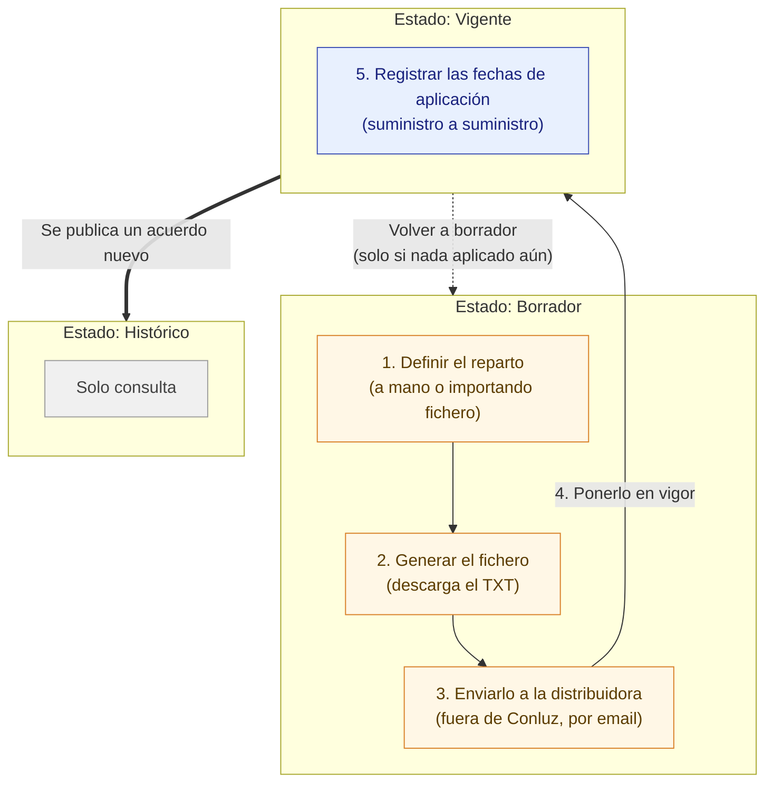

# Manual de uso: Acuerdos de reparto

Este manual explica, paso a paso, cómo usar la sección **Acuerdos de reparto** de Conluz. Está pensado para personas que la usan por primera vez.

## ¿A quién va dirigido este manual?

A **administradores de comunidad**. Esta sección solo es accesible para quien tiene el rol de administrador en la comunidad activa; los miembros de la comunidad que no tengan rol de administrador no ven esta pantalla.

## ¿Qué es un acuerdo de reparto?

Un acuerdo de reparto define **qué porcentaje de la energía producida por una planta corresponde a cada punto de suministro** (vivienda, local, etc.) de la comunidad energética. Ese porcentaje se llama **coeficiente de reparto**, y la suma de todos los coeficientes de un acuerdo debe ser siempre **100,0000 %**.

Cada acuerdo pasa por tres estados a lo largo de su vida:

| Estado | Significado |
|---|---|
| **Borrador** | Se está preparando. Los coeficientes se pueden editar libremente. |
| **Vigente** | Ya se ha puesto en marcha. Los coeficientes quedan fijados y no se pueden editar; solo se puede registrar cuándo la distribuidora aplica cada uno. |
| **Histórico** | Ha sido sustituido por un acuerdo posterior. Es de solo consulta. |

Dentro de un acuerdo, preparar y desplegar el reparto sigue conceptualmente **cinco pasos**:

1. **Definir el reparto** — introducir los coeficientes, a mano o importando un fichero.
2. **Generar el fichero** — Conluz construye el fichero TXT que hay que enviar a la distribuidora.
3. **Enviarlo a la distribuidora** — fuera de Conluz, normalmente por email. La aplicación no puede comprobar este paso.
4. **Ponerlo en vigor** — sellar el reparto una vez que la distribuidora lo ha aceptado.
5. **Registrar las fechas de aplicación** — anotar, suministro a suministro, cuándo la distribuidora ha empezado a aplicar cada coeficiente.

*Los pasos 1 a 3 ocurren mientras el acuerdo está en **Borrador**; el paso 4 (Poner en vigor) es la transición a **Vigente**; el paso 5 ocurre ya en estado **Vigente**. Un acuerdo pasa a **Histórico** cuando se publica un acuerdo posterior para la misma planta.*

---

## Índice

1. [Acceder a la sección](#1-acceder-a-la-sección)
2. [Crear un nuevo acuerdo de reparto](#2-crear-un-nuevo-acuerdo-de-reparto)
3. [Definir el reparto (coeficientes)](#3-definir-el-reparto-coeficientes)
4. [Generar el fichero para la distribuidora](#4-generar-el-fichero-para-la-distribuidora)
5. [Enviar el fichero a la distribuidora](#5-enviar-el-fichero-a-la-distribuidora)
6. [Poner el acuerdo en vigor](#6-poner-el-acuerdo-en-vigor)
7. [Registrar la fecha de aplicación de cada suministro](#7-registrar-la-fecha-de-aplicación-de-cada-suministro)
8. [Volver a borrador](#8-volver-a-borrador)
9. [Gestionar coeficientes ya aplicados](#9-gestionar-coeficientes-ya-aplicados)
10. [Eliminar un acuerdo](#10-eliminar-un-acuerdo)
11. [Consultar un acuerdo histórico](#11-consultar-un-acuerdo-histórico)
12. [Buscar y filtrar](#12-buscar-y-filtrar)
13. [Qué puedo hacer en cada estado (resumen)](#13-qué-puedo-hacer-en-cada-estado-resumen)
14. [Solución de problemas y preguntas frecuentes](#14-solución-de-problemas-y-preguntas-frecuentes)

---

## 1. Acceder a la sección

1. Entra en la ficha de la planta desde **Producción**.
2. Accede a **Acuerdos de Reparto**. La ruta de navegación (breadcrumb) muestra: `Inicio → Producción → [Planta] → Acuerdos de Reparto`.

Si tu rol en la comunidad activa no es de administrador, no podrás acceder a esta pantalla.

<!-- SCREENSHOT: breadcrumb de navegación hasta "Acuerdos de Reparto" -->

Al entrar verás:

- Un encabezado con el nombre de la planta y su **CAU** (código regulatorio).
- Tres indicadores con el número de acuerdos en cada estado: **Vigente**, **Borradores** e **Históricos**.
- La lista de acuerdos existentes, ordenados en una línea de tiempo.

<!-- SCREENSHOT: vista completa de la lista de acuerdos de reparto de una planta, con los indicadores de estado y la línea de tiempo -->

---

## 2. Crear un nuevo acuerdo de reparto

1. En la lista de acuerdos, pulsa **Nuevo acuerdo de reparto**.
2. Rellena el formulario:
   - **Capacidad de generación de la planta** (en kW): la potencia pico instalada en el momento de este acuerdo. Debe ser un número mayor que 0. Se rellena automáticamente con la potencia registrada de la planta, aunque puedes ajustarla.
   - **Nombre del acuerdo**: un nombre identificativo, por ejemplo *"Recálculo julio 2026"*. Es obligatorio.
   - **Notas internas** (opcional): motivo del nuevo reparto, cambios respecto al anterior, etc.
3. Pulsa **Crear borrador**.

El acuerdo se crea en estado **Borrador** y la aplicación te lleva directamente a su pantalla de detalle.

> **Aviso que verás en el formulario:** al poner en vigor un acuerdo, el conjunto de coeficientes queda fijo para siempre; cualquier cambio futuro requerirá un nuevo acuerdo. Tenlo en cuenta antes de avanzar en el ciclo de vida.

<!-- SCREENSHOT: diálogo "Nuevo acuerdo de reparto" con los campos Capacidad, Nombre y Notas rellenados -->

---

## 3. Definir el reparto (coeficientes)

Desde la pantalla de detalle de un acuerdo en **Borrador**, tienes dos formas de definir los coeficientes. Elige la que mejor se adapte a tu caso.

### 3a. Introducir los coeficientes a mano

1. Pulsa **Editar coeficientes**.
2. Si necesitas añadir suministros al reparto, pulsa **Añadir suministro**, marca los suministros deseados en el buscador (por nombre o CUPS) y confirma con **Añadir (N)**.
3. Para cada suministro de la tabla, escribe su coeficiente. Puedes alternar la unidad de entrada con el interruptor **Editar coeficientes en: Coeficiente | kW**, según prefieras trabajar en porcentaje o en kW.
4. Revisa la **suma del fichero**: debe llegar exactamente a 100 %. La pantalla te indica cuánto falta o sobra mientras editas.
5. Pulsa **Guardar** para confirmar los coeficientes, o **Cancelar** para descartar los cambios.

Puedes quitar un suministro de la edición con el icono de eliminar de su fila.

<!-- SCREENSHOT: tabla en modo edición de coeficientes, mostrando varios suministros con su coeficiente y el resumen de suma total -->

### 3b. Importar un fichero ya elaborado

Si ya tienes preparado el fichero TXT del reparto (por ejemplo, generado por otro medio), puedes importarlo directamente:

1. En el panel **Fichero para la distribuidora**, pulsa **Importar un fichero que ya tengas**.
2. Selecciona el fichero con **Seleccionar fichero** (debe tener extensión `.txt` y seguir el formato de nombre `<CAU>_AAAA.txt`).
3. Pulsa **Subir fichero**.

> **Importante:** subir un fichero nuevo **sustituye por completo** el conjunto de coeficientes actual del acuerdo.

Si el fichero no es válido, la aplicación no modifica ningún coeficiente y te muestra el detalle de los errores (por fichero o por línea, por ejemplo *"el CUPS … no pertenece a ningún suministro"*) para que los corrijas en origen y vuelvas a intentarlo con **Elegir otro fichero**.

Si la planta no tiene CAU asignado, no podrás importar un fichero hasta añadirlo desde a la planta.

<!-- SCREENSHOT: diálogo de importación de fichero, y por separado la pantalla de errores de validación de un fichero rechazado -->

---

## 4. Generar el fichero para la distribuidora

Una vez que la suma de los coeficientes es exactamente 100 %, puedes generar el fichero que enviarás a la distribuidora:

1. En el panel **Fichero para la distribuidora**, pulsa **Generar fichero**.
2. Indica el **Año** correspondiente al reparto.
3. Pulsa **Generar**.

El fichero se descarga automáticamente con el nombre `<CAU>_<año>.txt`. Ten en cuenta que **generar el fichero no lo guarda en el acuerdo**: es una descarga puntual a partir de los coeficientes en ese momento. Si vuelves a cambiar los coeficientes, tendrás que generarlo de nuevo.

Este botón está desactivado (con el motivo indicado debajo) cuando:
- la planta no tiene CAU asignado, o
- la suma de los coeficientes todavía no es exactamente 100 %.

<!-- SCREENSHOT: diálogo "Generar fichero" con el campo Año, y el aviso posterior a la descarga -->

---

## 5. Enviar el fichero a la distribuidora

Este paso ocurre **fuera de Conluz**: envía el fichero generado a la distribuidora eléctrica por tu canal habitual (normalmente email). La aplicación no realiza ni verifica este envío, así que asegúrate de conservar constancia por tu cuenta.

---

## 6. Poner el acuerdo en vigor

Cuando la distribuidora haya aceptado el reparto, sella el acuerdo:

1. En la pantalla de detalle, abre el menú de tres puntos (**⋮ Más opciones del acuerdo**), junto al nombre del acuerdo.
2. Selecciona **Poner en vigor**.
3. Confirma en el diálogo.

El acuerdo pasa a estado **Vigente** y sus coeficientes dejan de poder editarse.

Esta opción aparece deshabilitada, con el motivo indicado, si:
- el acuerdo todavía no tiene coeficientes, o
- la suma de los coeficientes no es exactamente 100,0000 % (se te indica cuánto falta o sobra).

> **Aviso que verás en el diálogo de confirmación:** poner en vigor no aplica nada por sí mismo — es normal que, justo después, ningún coeficiente esté aún aplicado. Podrás volver a borrador mientras no se haya aplicado ninguno; en cuanto se aplique el primero, dejará de ser posible.

<!-- SCREENSHOT: menú de tres puntos del detalle del acuerdo abierto, mostrando la opción "Poner en vigor", y el diálogo de confirmación -->

---

## 7. Registrar la fecha de aplicación de cada suministro

Con el acuerdo **Vigente**, a medida que la distribuidora vaya aplicando el reparto a cada suministro, regístralo en Conluz:

1. En la tabla de coeficientes, localiza la fila del suministro (puedes filtrar por **Sin aplicar** para verlos todos).
2. Abre su menú de acciones (**⋯**) y selecciona **Registrar fecha**.
3. Indica la **Fecha de aplicación** (no puede ser una fecha futura) y confirma con **Registrar fecha**.

### Registrar varias fechas a la vez

Si varios suministros comparten la misma fecha de aplicación, márcalos con la casilla de su fila (o **Seleccionar todas** en móvil). En la barra que aparece al pie de la pantalla, pulsa **Acciones → Registrar fecha** para aplicarlo a todos los seleccionados de una vez.

<!-- SCREENSHOT: tabla de coeficientes con el filtro "Sin aplicar" activo, el menú de fila abierto en "Registrar fecha", y la barra de selección múltiple al pie -->

---

## 8. Volver a borrador

Si necesitas corregir algo antes de que la distribuidora haya aplicado ningún coeficiente, puedes deshacer el paso a vigor:

1. En el menú de tres puntos del detalle, selecciona **Volver a borrador**.
2. Confirma en el diálogo.

El acuerdo vuelve a estado **Borrador** y sus coeficientes vuelven a ser editables.

> Esta opción solo está disponible mientras **ningún** coeficiente del acuerdo se haya marcado todavía como aplicado. En cuanto se registre la primera fecha de aplicación, esta opción desaparece y cualquier corrección posterior requerirá un acuerdo nuevo.

---

## 9. Gestionar coeficientes ya aplicados

Una vez que un coeficiente está aplicado, sigue teniendo acciones disponibles en su menú de fila (**⋯**), todas ellas con efecto retroactivo sobre el histórico de producción de ese suministro:

| Acción | Cuándo está disponible | Qué hace |
|---|---|---|
| **Corregir fecha** | Coeficiente aplicado | Cambia la fecha de aplicación y recalcula la producción atribuida desde entonces. |
| **Desactivar** | Coeficiente aplicado | Revierte la activación; el coeficiente vuelve a quedar pendiente de aplicación. |
| **Cerrar (baja)** | Coeficiente aplicado y sin fecha de fin | Indica la fecha en la que el suministro deja de recibir producción de este reparto. |
| **Reabrir** | Coeficiente cerrado | Elimina la fecha de fin y reabre el coeficiente. |

Todas estas acciones también admiten selección múltiple desde la barra de acciones al pie de la tabla, y muestran una advertencia explícita sobre el efecto retroactivo antes de confirmarse.

<!-- SCREENSHOT: menú de fila de un coeficiente aplicado mostrando las opciones Corregir fecha / Desactivar / Cerrar (baja), y un diálogo de confirmación con el aviso de efecto retroactivo -->

---

## 10. Eliminar un acuerdo

Solo puedes eliminar un acuerdo mientras está en **Borrador**:

1. Desde la lista de acuerdos, abre el menú (**⋮**) de la tarjeta del acuerdo, o desde su pantalla de detalle, el menú de tres puntos.
2. Selecciona **Eliminar**.
3. Confirma en el diálogo, que te recuerda que se eliminarán permanentemente el borrador y sus coeficientes.

Eliminar un borrador **no afecta** al historial de reparto de los miembros, ya que ningún cálculo depende de un borrador.

<!-- SCREENSHOT: diálogo de confirmación "Eliminar acuerdo de reparto" -->

---

## 11. Consultar un acuerdo histórico

Cuando se pone en vigor un acuerdo nuevo para la misma planta, el acuerdo anterior pasa automáticamente a **Histórico**. Un acuerdo histórico es de solo consulta:

- No tiene menú de opciones (no se puede editar, poner en vigor, volver a borrador ni eliminar).
- Conserva la tabla de coeficientes y sus estados de aplicación tal como quedaron.
- No permite generar ni importar un nuevo fichero.

Úsalo para consultar cómo estaba configurado el reparto en un periodo anterior.

---

## 12. Buscar y filtrar

- **En la lista de acuerdos**: usa el buscador (por nombre o notas) y los chips **Todos / Borrador / Vigente / Histórico** para localizar un acuerdo concreto.
- **Dentro de un acuerdo**: en la tabla de coeficientes, usa el buscador (por punto o CUPS) y, cuando esté disponible, los chips **Todos / Sin aplicar / En vigor** para filtrar por estado de aplicación.

<!-- SCREENSHOT: buscador y chips de estado en la lista de acuerdos -->

---

## 13. Qué puedo hacer en cada estado (resumen)

| Estado del acuerdo | Editar coeficientes | Generar/Importar fichero | Poner en vigor | Volver a borrador | Registrar/corregir fechas | Eliminar |
|---|---|---|---|---|---|---|
| **Borrador** | Sí | Sí | Sí (si suma = 100 %) | — | — | Sí |
| **Vigente**, sin nada aplicado todavía | No | No | — | Sí | Sí (registrar) | No |
| **Vigente**, con algún coeficiente ya aplicado | No | No | — | No | Sí (registrar/corregir/desactivar/cerrar/reabrir) | No |
| **Histórico** | No | No | — | — | No | No |

> Ten en cuenta que, en un acuerdo **Vigente con algún coeficiente ya aplicado**, el menú de tres puntos del detalle desaparece por completo: las únicas acciones posibles a partir de ese momento son las de fecha de aplicación en cada fila de la tabla de coeficientes.

---

## 14. Solución de problemas y preguntas frecuentes

**"Esta planta no tiene código regulatorio (CAU) asignado."**
No podrás generar ni importar el fichero de reparto hasta añadir el CAU desde la ficha de la planta.

**"La suma de los coeficientes debe ser exactamente 100 % para generar el fichero" / mensaje de "Faltan X % / Sobran X %"**
Revisa los coeficientes en modo edición: la suma total debe llegar exactamente a 100,0000 %, ni más ni menos, para poder generar el fichero o poner el acuerdo en vigor.

**"El fichero no se ha podido importar. No se ha modificado ningún coeficiente del borrador."**
El fichero importado tenía errores (de formato o de contenido, por ejemplo un CUPS que no corresponde a ningún suministro de la comunidad). La pantalla detalla los errores encontrados; corrige el fichero de origen y vuelve a intentar la importación con **Elegir otro fichero**.

**No veo el menú de opciones (⋮) en un acuerdo Vigente**
Es esperado si al menos un coeficiente del acuerdo ya ha sido aplicado: a partir de ese momento el acuerdo queda fijo salvo por el registro de fechas de aplicación por suministro (ver [sección 13](#13-qué-puedo-hacer-en-cada-estado-resumen)).

**"Planta no encontrada" / "Acuerdo no encontrado"**
La planta o el acuerdo no existen, o no pertenecen a una comunidad a la que tengas acceso. Verifica el enlace o vuelve a la lista de plantas.

**No hay acuerdos de reparto en la lista**
Si es la primera vez que se usa esta planta, es normal: todavía no se ha creado ningún acuerdo. Pulsa **Nuevo acuerdo de reparto** para crear el primero. Si esperabas ver acuerdos y no aparecen, comprueba que no tengas un filtro de estado o una búsqueda activos.

**Necesito cambiar un dato tras poner el acuerdo en vigor**
No es posible mientras el acuerdo siga vigente: los coeficientes quedan fijos al ponerlo en vigor. Si aún no se ha aplicado ningún coeficiente, puedes usar **Volver a borrador** (ver [sección 8](#8-volver-a-borrador)); si ya se ha aplicado alguno, necesitarás crear un acuerdo nuevo.
